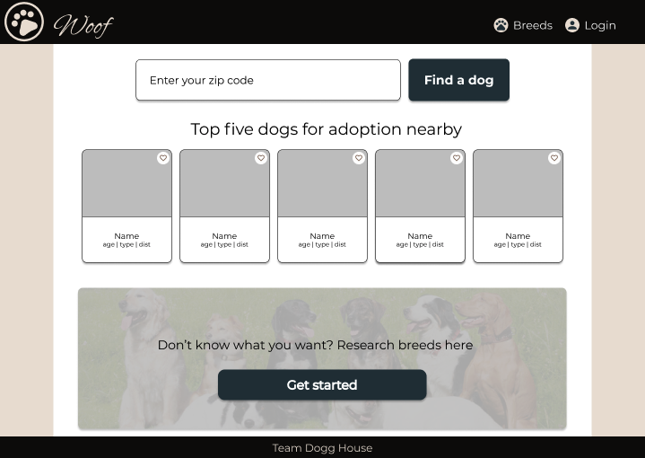
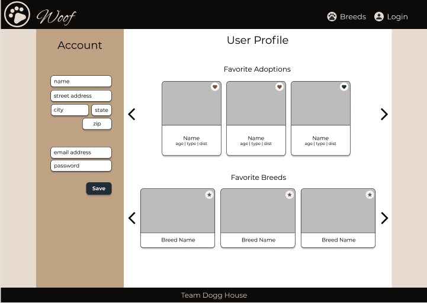
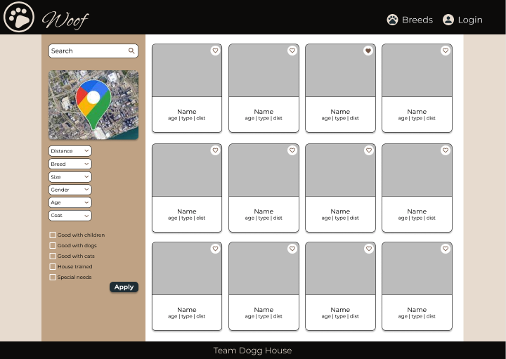
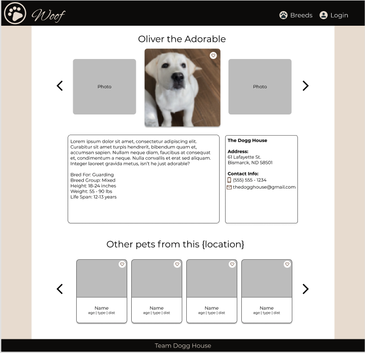
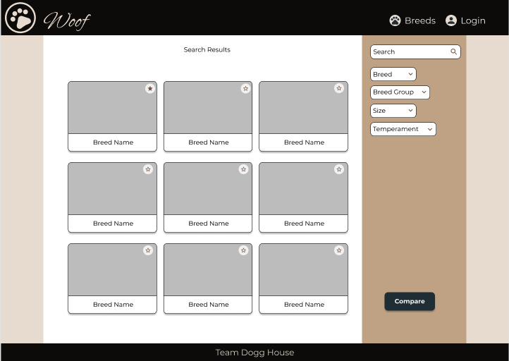
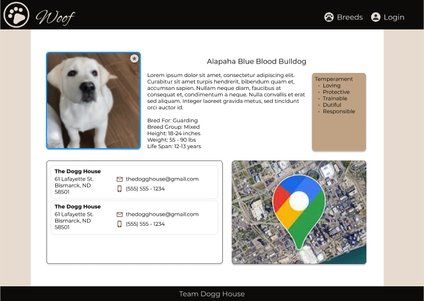

<h1 align="center"> WOOF</h1>

# Contributors:
<br />


**Alicia Villanueva** - Project Manager<br>
[GitHub](https://github.com/aliciav-texas) • [LinkedIn](https://www.linkedin.com/in/alicia-villanueva-atx/)


**Johnathan Brennan** - Project Manager<br>
[GitHub](https://github.com/JohnathanBrennan) • [LinkedIn](https://www.linkedin.com/in/johnathan-brennan/)


**Ben Kern** - System Architect<br>
[GitHub](https://github.com/bkern98) • [LinkedIn](https://www.linkedin.com/in/benjamin-kern-4a7371184/)


**Don Vida** - UI Designer<br>
[GitHub](https://github.com/UnlikelyHero) • [LinkedIn](https://www.linkedin.com/in/donald-vida/)


**Maria Kim** - UI Designer<br>
[GitHub](https://github.com/mariaykim) • [LinkedIn](https://www.linkedin.com/in/mariakim21/)


**Kristin Gadgil** - Full Stack Engineer<br>
[GitHub](https://github.com/itsme-kristin) • [LinkedIn](https://www.linkedin.com/in/kristingadgil/)


**Rob Williams** - Full Stack Engineer<br>
[GitHub](https://github.com/robwilliams-it) • [LinkedIn](https://www.linkedin.com/in/rob-williams-swe/)

<br />

# Table of Contents

 - [About this project](#about)
 - [Workflow](#workflow)
 - [Technologies](#technologies)
 - [Links](#links)
 - [Installation](#install)
 - [APIs](#apis)

<hr />
<br />

# About the Project <a name="about"></a>
Woof is a one-stop shop for a user to research dog breeds, find a pet nearby ready for its forever home, and locate nearby groomers. The user can create an authenticated account to save their favorite dogs and breeds and have a tailored experience based on their location.

THIS WILL BE A GIF OF LANDING PAGE

## Key Features
- User authentication
- Displays dogs nearby available for adoption
- Explore breeds and compare
- Select dogs and breeds to add to favorites
- View favorite dogs and breeds on user profile
- Contact rescues and shelters with the adoptable dog selected

## Home Page

THIS WILL BE A GIF OF THE FUNCTIONALITY OF THE HOME PAGE

- Click on a dog to see more information
- Click the heart icon to add dog to your favorites or delete
- Enter your zip code to search for dogs near you
- Click the GET STARTED button to research dog breeds

## User Authentication

THIS WILL BE A GIF OF THE FUNCTIONALITY OF USER AUTHENTICATION

- Click on SIGN UP  to create a new account
- Enter information that will be used for authentication and website personalization
- Click on SIGN IN to access your account
- Click on LOGOUT to exit your account

## Adopt

THIS WILL BE A GIF OF THE FUNCTIONALITY OF THE ADOPT PAGE

- Enter your zip code to find dogs near you
- View map that shows your location and nearby organizations and groomers
- Click on a map icons to see more information about the organization or groomer
- Click on a dog card to see more dog information
- Click the heart icon to add dog to your favorites or delete
- Filter dogs shown based on distance, size, gender, age, coat, and other relevant information

## Pet Overview

THIS WILL BE A GIF OF THE FUNCTIONALITY OF THE PET OVERVIEW

- View all pictures of the specific dog
- View description of the dog
- View information on where the dog is located
- Add or delete the dog from your favorites
- Click on the email link to contact the organization
- View other pets available at the organization

## Breeds

THIS WILL BE A GIF OF THE FUNCTIONALITY OF THE BREEDS PAGE

- View all dog breeds available for research
- Filter dog breeds based on breed group, size, temperament
- View comparison of two selected dog breeds
- Click on a breed card to see more breed information
- Click the star icon to add breed to your favorites or delete

## Breed Overview

THIS WILL BE A GIF OF THE FUNCTIONALITY OF THE BREED OVERVIEW

- View information about the selected breed
- Click the star icon to add breed to your favorites or delete
- View map that shows your location and nearby organizations and groomers
- Click on the map icons to see more information about the organization or groomer

## My Profile

THIS WILL BE A GIF OF THE FUNCTIONALITY OF MY PROFILE

- View your information associated with your account
- Update your information associated with your account
- View your favorite breeds
- View your favorite dogs
- Click on a card to see more information about the dog or breed
- Click on an icon to add more remove from your favorites


</hr>
</br>

# Workflow <a name="workflow"></a>
Our team used Agile workflow for this sprint.

## Trello
A Trello board was used to create and track tickets.  We held daily meetings to discuss accomplishments, challenges, and upcoming tickets.  To effectively collaborate remotely while allowing for quick communication if needed, we utilized Discord and Zoom.

## Version Control
We implemented Git Feature Branch Workflow.  All pull requests in Github were reviewed by another team member before being merged into the main branch.

<hr />
<br />

# Technologies <a name="technologies"></a>

<table>
  <tbody>
    <tr>
      <td>Front End Languages</td>
      <td>
        
        
        
      </td>
    </tr>
    <tr>
      <td>Frameworks & Libraries</td>
      <td>
        
        
        
      </td>
    </tr>
      <td>Database & Back End</td>
      <td>
        
        
        
        
      </td>
    </tr>
      <td>Design</td>
      <td>
        
      </td>
    </tr>
    <tr>
      <td>Utilities</td>
      <td>
        
        
        
        
      </td>
    </tr>
     <tr>
      <td>Workflow</td>
      <td>
        
        
        
        
      </td>
    </tr>
    <tr>
      <td>Deployment</td>
      <td>
        
        
      </td>
    </tr>
  </tbody>
</table>

<hr />
<br />

# Links <a name="links"></a>







<br />
<a href="https://www.figma.com/file/KaLenlfZ7lHquYeXoVAdh1/Woof?node-id=0%3A1">Link to Figma Wireframes</a>

<a href="https://www.notion.so/Woof-Engineering-Journal-0bced2f6f68b4d48995b9700d367e65f">Link to Engineering Journal - WOOF</a>

We pulled our breed information from...and then we...you can use whichever API that best suits your needs.
<hr />
<br />

# Installation <a name="install"></a>

<br />


WOOF requires both `NodeJs` and `npm` to run

1. Download the repo using git

```
git clone https://github.com/hratx-blue-ocean/WOOF.git
```

2. Install dependencies

```
npm install
```

3. Create a `config.js` file in the root directory:

```
  mongoURI: "{{ Your MongoDB Cluster URL here }}",

  petfinderConfig: {
    "grant_type": "client_credentials",
    "client_id": "{{ Petfinder client_id }}",
    "client_secret": "{{ Petfinder client_secret"
  },

  googleAPI: "{{ google API key }}",

  FIREBASE_API_KEY: '{{ Firebase API Key }}',
  FIREBASE_AUTH_DOMAIN: '{{ Firebase Auth Domain URL }}',
  FIREBASE_PROJECT_ID: '{{ Firebase Project ID }}',
  FIREBASE_STORAGE_BUCKET: '{{ Firebase Storage URL }}',
  FIREBASE_MESSAGING_SENDER_ID: '{{ Firebase Messaging Sender ID }}',
  FIREBASE_APP_ID: '{{ Firebase App ID }}',
```
 - **Note:** See the [Links](#links) section for these services to generate your authentication

4. Run the Webpack compiler

 - In Production:<br>
   ```
   npm run build
   ```

 - In Development:<br>
   ```
   npm run build-dev
   ```

5. Start the Server

```
npm start
```

# APIs <a name="apis"></a>

<hr />
<br />